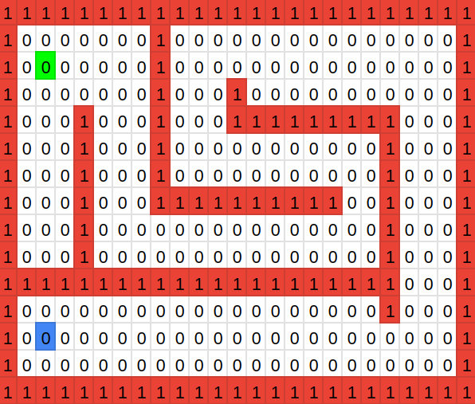
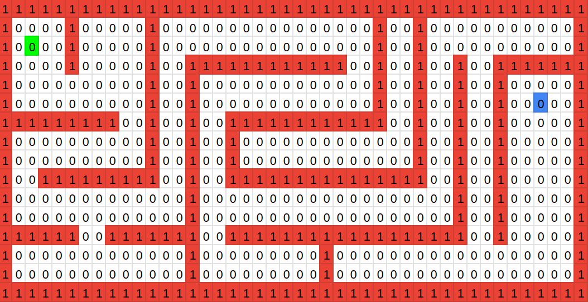

# ROS 2 Turtlebot 3 Map Explorer
## Description
In this repo we use Turtlebot 3 along with ROS 2 and Gazebo to explore an unknown csv environment, navigate through it and create a map. 

The map is created using SLAM with the package [Google Cartographer](https://github.com/cartographer-project/cartographer) and navigation is achieved with [Nav2](https://github.com/ros-planning/navigation2) package. We have developed two exploring algorithyms:

>**Wanderer Exploration** explores the map doing random turns when it detects an obstacle. It's a convenient way to explore small maps but time consuming for bigger ones.
  
>**Discoverer Exploration** prioritizes specific unknown hotspots of the map convoluting the occupancy grid. It's a better way to explore bigger maps in exchange of a higher computational cost.

Watch this following video to see core functionality: [https://youtu.be/UNiCngwE_Zo](https://youtu.be/UNiCngwE_Zo)

## Pre-requisites
You need to have both Ubuntu 20.04 and ROS2 Foxy, install by following these guides

### Ubuntu 20.04
You have two options of installing Ubuntu 20.04, either in a virtual machine or dual boot(or dual boot but erase everything).
1. [Install Ubuntu 20.04 (Dual boot) [Recommended]](https://www.youtube.com/watch?v=-iSAyiicyQY)
2. [Install Ubuntu 20.04 (Virtual Machine)](https://www.youtube.com/watch?v=IOwlnpWPuj0)

### ROS 2 Foxy
You have two options of installing ROS2 Foxy:
1. [Install ROS2 Foxy the official way, follow steps in link](https://docs.ros.org/en/foxy/Installation/Linux-Install-Debians.html)
2. [Install ROS2 Foxy with unofficial way follow steps below [Recommended]](https://github.com/Tiryoh/ros2_setup_scripts_ubuntu)

```
sudo apt install git -y
git clone https://github.com/Tiryoh/ros2_setup_scripts_ubuntu
cd ros2_setup_scripts_ubuntu
./ros2-foxy-desktop-main.sh
``` 

## Installation of project
Now that Ubuntu 20.04 and ROS2 Foxy is installed, continue with project installation to get started

Don't forget to install colcon:
```
sudo apt install python3-colcon-common-extensions
```
Install Gazebo:
```
curl -sSL http://get.gazebosim.org | sh
```
Install packages:
```
sudo apt install ros-foxy-gazebo-ros-pkgs ros-foxy-cartographer ros-foxy-cartographer-ros ros-foxy-navigation2 ros-foxy-nav2-bringup
sudo apt install ros-foxy-turtlebot3-msgs ros-foxy-dynamixel-sdk ros-foxy-hls-lfcd-lds-driver
```
Install Python libraries:
```
sudo apt install python3-pip
pip3 install pandas
```
Create a ROS2 workspace:
```
mkdir -p ~/turtlebot3_ws/src
cd ~/turtlebot3_ws/src
```
Clone the repository:
```
git clone https://github.com/swepz/ros2_explorer.git
```
Clone turtlebot original repository to have additional utilities:
```
git clone -b foxy-devel https://github.com/ROBOTIS-GIT/turtlebot3.git
git clone -b foxy-devel https://github.com/ROBOTIS-GIT/turtlebot3_simulations.git
```

Copy paste the following into terminal
```
echo "source /opt/ros/foxy/setup.bash" >> ~/.bashrc
echo "source /usr/share/colcon_cd/function/colcon_cd.sh" >> ~/.bashrc
echo "export _colcon_cd_root=~/turtlebot3_ws" >> ~/.bashrc
echo "source ~/turtlebot3_ws/install/setup.bash" >> ~/.bashrc
echo "export TURTLEBOT3_MODEL=burger" >> ~/.bashrc
echo "export GAZEBO_MODEL_PATH=~/turtlebot3_ws/src/ros2_explorer/explorer_gazebo/models" >> ~/.bashrc
source ~/.bashrc
```
Compile packages:
```
cd ~/turtlebot3_ws/
colcon build
source install/setup.bash
```

## How to run
Execute the launch file of the map you want to use (Opens Gazebo simulation, Rviz, Cartographer, Nav2 and exploration servers):
```
ros2 launch explorer_bringup map1.launch.py
```
Execute manager node and select exploring algorithm:
```
ros2 run explorer_bringup manager
```


## Map description


Map 1: is the training map, it's a small map with a few obstacles and a few unknown areas.



Map 2: is the testing map, it's a bigger map with more obstacles and more unknown areas.



The color green is the starting point, while blue is the goal point. The red color is the obstacles and the white color is the safe areas.

## Testing commands
Cartographer launch:
```
ros2 launch explorer_cartographer cartographer.launch.py use_sim_time:=True
```
Navigation launch:
```
ros2 launch explorer_navigation2 nav.launch.py use_sim_time:=True
```
Move the robot manually:
```
ros2 run turtlebot3_teleop teleop_keyboard
```

Save a map:
```
ros2 run nav2_map_server map_saver_cli
```
Here is a crash course for working with navigation and maps ![ROS2 Nav2 - Navigation Stack in 1 Hour [Crash Course]](https://www.youtube.com/watch?v=idQb2pB-h2Q)


Publish a goal:
```
ros2 action send_goal /navigate_to_pose nav2_msgs/action/NavigateToPose "{pose: {header: {stamp: {sec: 0}, frame_id: 'map'}, pose: {position: {x: 0.0, y: 0.0, z: 0.0}, orientation: {w: 1.0}}}}"
```
## Package structure


